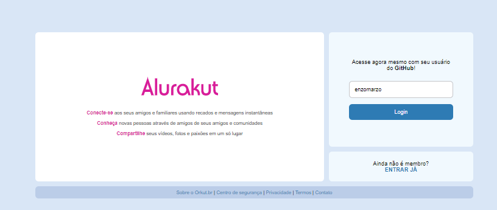
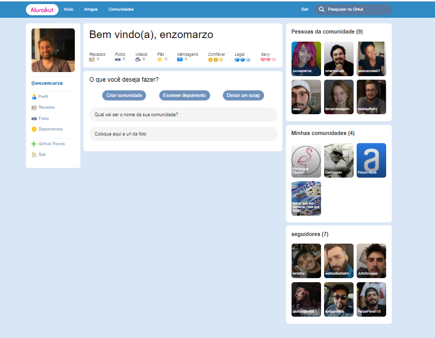

# App created with next.js and styled-components

## What I have done in this project:

 - created an react app with next.js
 - using a Figma layout to create our front-end
 - Why and How to use **useState** and **useEffect** from React
 - Using DatoCMS (a back-end as a service) and GraphQL to create and use our database
 - Using datocms-client to send information to the database
 - The JS function .fetch and async/await to consume our API
 - Creating and validating the Login Page

## Deploy your own

Deploy the example using [Vercel](https://vercel.com?utm_source=github&utm_medium=readme&utm_campaign=next-example):

